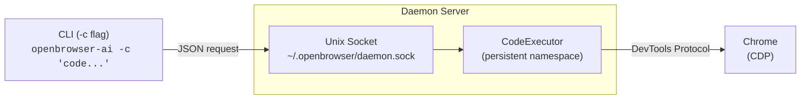

## Overview

The CLI daemon provides a persistent browser session over a Unix socket. Use the `-c` flag to execute Python code directly from Bash -- no MCP server, no LLM, just code and a browser.

The daemon starts automatically on first use, persists variables across calls, and shuts down after 10 minutes of inactivity.

## Quick Start

```bash
# Navigate to a page
uvx openbrowser-ai -c "await navigate('https://example.com')"

# Extract data
uvx openbrowser-ai -c "print(await evaluate('document.title'))"

# Multi-step interaction
uvx openbrowser-ai -c "
await navigate('https://news.ycombinator.com')
state = await browser.get_browser_state_summary()
print(state.title)
print(f'{len(state.dom_state.selector_map)} interactive elements')
"
```

## Variable Persistence

Variables set in one `-c` call are available in the next, as long as the daemon is running:

```bash
uvx openbrowser-ai -c "await navigate('https://example.com')"
uvx openbrowser-ai -c "title = await evaluate('document.title')"
uvx openbrowser-ai -c "print(title)"  # still available
```

This enables incremental exploration -- navigate in one call, extract in the next, process in the third.

## Daemon Management

```bash
uvx openbrowser-ai daemon start     # Start daemon (auto-starts on first -c call)
uvx openbrowser-ai daemon stop      # Stop daemon and close browser
uvx openbrowser-ai daemon status    # Show PID, init state, idle timeout
uvx openbrowser-ai daemon restart   # Restart with fresh browser session
```

The daemon runs in the background and communicates via a Unix socket at `~/.openbrowser/daemon.sock`. Logs are written to `~/.openbrowser/daemon.log`.

> **Windows**: On Windows, the daemon uses a localhost TCP connection on port 19222 instead of a Unix socket. This means any process on the same machine can connect. The Unix socket on macOS/Linux is restricted to the file owner (mode `0600`).

## Available Functions

All functions from the MCP `execute_code` tool are available in `-c` mode:

| Category | Functions |
|----------|-----------|
| **Navigation** | `navigate(url, new_tab)`, `go_back()`, `wait(seconds)` |
| **Interaction** | `click(index)`, `input_text(index, text, clear)`, `scroll(down, pages, index)`, `send_keys(keys)`, `upload_file(index, path)` |
| **Dropdowns** | `select_dropdown(index, text)`, `dropdown_options(index)` |
| **Tabs** | `switch(tab_id)`, `close(tab_id)` |
| **JavaScript** | `evaluate(code)` -- run JS in page context, returns Python objects |
| **Downloads** | `download_file(url, filename)`, `list_downloads()` |
| **State** | `browser.get_browser_state_summary()` -- page metadata and interactive elements |
| **CSS** | `get_selector_from_index(index)` -- CSS selector for an element |
| **Completion** | `done(text, success)` -- signal task completion |

**Pre-imported libraries**: `json`, `csv`, `re`, `datetime`, `asyncio`, `Path`, `requests`

Optional (imported on first use): `numpy`/`np`, `pandas`/`pd`, `matplotlib`/`plt`, `BeautifulSoup`, `PdfReader`, `tabulate`

## Multi-Action Batching

Batch multiple actions in a single call for efficiency:

```bash
uvx openbrowser-ai -c "
await navigate('https://example.com/search')
await input_text(1, 'python automation')
await click(2)
await wait(2)
state = await browser.get_browser_state_summary()
print(f'Results page: {state.title}')
"
```

## Architecture



- The **CLI** is a thin client (~30ms startup) that sends code over the Unix socket
- The **daemon** holds the browser session, CodeExecutor, and persistent namespace in memory
- The **browser** connects via Chrome DevTools Protocol (CDP)

## Configuration

| Variable | Description | Default |
|----------|-------------|---------|
| `OPENBROWSER_HEADLESS` | Run browser without GUI | `false` |
| `OPENBROWSER_MAX_OUTPUT` | Maximum output characters per execution | `10000` |
| `OPENBROWSER_SOCKET` | Custom Unix socket path | `~/.openbrowser/daemon.sock` |

## Comparison with MCP Server

| Feature | CLI Daemon (`-c`) | MCP Server (`--mcp`) |
|---------|-------------------|---------------------|
| **Use case** | Bash scripts, shell pipelines, manual exploration | AI assistants (Claude, Codex) |
| **Intelligence** | You write the code | LLM writes the code |
| **Startup** | ~30ms (thin client) | ~150ms (full MCP init) |
| **Protocol** | Unix socket (JSON lines) | MCP over stdio |
| **Persistence** | Variables persist across `-c` calls | Variables persist across tool calls |
| **Idle timeout** | 10 minutes | Session-based |

Both use the same `CodeExecutor` engine and browser automation functions.

## Troubleshooting

**Daemon won't start**
- Check `~/.openbrowser/daemon.log` for errors
- Verify Chrome/Chromium is installed
- Remove stale files: `rm ~/.openbrowser/daemon.sock ~/.openbrowser/daemon.pid`

**"Daemon not running" on status**
- The daemon shuts down after 10 minutes of inactivity
- Run any `-c` command to auto-start it

**Socket permission errors**
- The socket is created with `0600` permissions (owner-only)
- Check that `~/.openbrowser/` is owned by your user

**Variables lost between calls**
- The daemon may have restarted (idle timeout or crash)
- Use `openbrowser-ai daemon status` to check if the daemon is running
